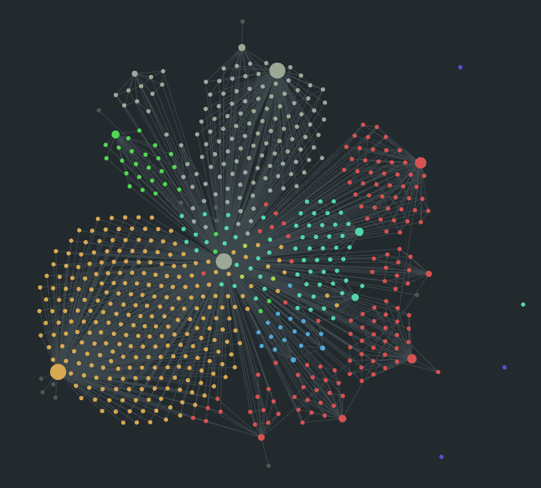

<!-- I create A new obsidian repository -->
# Welcome
<div style="display: flex; align-items: center;">
    
	<div style="flex: 1;">
		<h1><strong style="color:#e67e80">Welcome</strong> to my <em>Repository</em>.NO2608</h1>
		<p>Make a note of <strong style="color:#a7c080">something</strong>, This is <u style="color:#7fbbb3">Introduction</u>;</p>
		<p>Study notes, Develop notes<del>, or even diaries;</del> and so forth</p>
    </div>
</div>




-------------
# About Obsidian Repository
## Themes
I directly copied the CSS of [Everforest Spruce](https://github.com/vupdivup/obsidian-everforest-spruce) theme into the CSS snippets folder, which facilitates my modifications

## Plugins
- Code styler
- Git
- Git history
- drawio
- Iconize
- Advanced Line Number

## CSS snippets
1. FileTree: Customize file explorer folders
2. EverforestSpruce: Theme
3. plugins: Modify plugin's css


---- 

# `Markdown` 语法

## 通用语法

### 基本语法

| 代码              | 作用                       | HTML                                          |
| --------------- | ------------------------ | --------------------------------------------- |
| `-`             | 渲染为一个点, 同理还有`*`, `+`     | <ul><li>li</li><li>li</li></ul>               |
| `1. `           | 渲染为有序列表                  | <ol><li>li</li><li>li</li></ol>               |
| `- [ ] `        | 将渲染为代办, 写成`- [x]` 将渲染为完成 |                                               |
| `#`             | 渲染为一级标题, 同理`##` 为二级标题    | <h1>HTML Head 1</h1>                          |
| `**bold**`      | 文本加粗                     | <strong style="color:#e67e80">strong</strong> |
| `*Italic*`      | 文本倾斜                     | <em>em</em>                                   |
| `~~delete~~`    | 文本删除线                    | <del>del</del>                                |
| `==highlight==` | 文本高亮                     |                                               |
| `---`           | 渲染为分隔线                   |                                               |
| \`\`\`代码块\`\`\` | 渲染代码块                    | <code>code</code>                             |
| \`code\`        | 渲染一行代码                   |                                               |
| `[name](url)`   | 渲染链接                     |                                               |
| `>`             | 自己试试(quote)              |                                               |
| `[^1]`          | 引用                       |                                               |

### HTML Other

`{html}<strong style="color:#e67e80">HTML</strong>` 强调, 可配置颜色, 这个例子渲染的HTML字样是这样的: <strong style="color:#e67e80">HTML</strong>
其他颜色:
- <strong style="color:a7c080">编辑器</strong>  <strong style="color:e69875">编辑器</strong>  <strong style="color:e67e80">编辑器</strong>  <strong style="color:d0b2dd">编辑器</strong>  <strong style="color:7fbbb3">编辑器</strong>  <strong style="color:dbbc7f">编辑器</strong>  <strong style="color:d3c6aa">编辑器</strong> 

`{html}<u style="color:#e67e80">下划线</u>` HTML的下划线, 这个例子渲染的下划线字样是这样的: <u style="color:#e67e80">下划线</u>. 空格同样渲染: <u style="color:#e67e80"> </u> ,但只渲染一个, 可以这样:  <u style="color:#e67e80"> | | | . . . .</u>

用于缩进:
<dl>
  <dt>First Term</dt>
  <dd>This is the definition of the first term.</dd>
  <dd><div style="display: inline-block; width: 600px; height: 10px; background-color: #D3C6AA;"></div>  </dd>
  <dt>获取 <strong style="color:#E67E80;">出口公网 IP</strong></dt>
  <dd><code>curl -s ifconfig.me</code> 或者<code> dig +short myip.opendns.com @resolver1.opendns.com</code> 所以显示的就是通过 ISP 出口看到的地址（可能是 NAT 分配的）</dd>
  <li>如果你在 <strong style="color:#E67E80;">WSL</strong> 里运行这个tmux插件，获取的 IP 也是 Windows 宿主机的公网出口 IP，不会是 WSL 内部的 <code>192.168.*.*</code> 或 <code>172.*.*</code></li>
</dl>

左侧嵌入图片:
<div style="display: flex; align-items: center;">
    
	<div style="flex: 1;">
        <p><strong>Nginx</strong></p>
        <p>异步框架的<a href="https://zh.wikipedia.org/wiki/%E7%B6%B2%E9%A0%81%E4%BC%BA%E6%9C%8D%E5%99%A8" title="网页服务器">网页服务器</a>，也可以用作<a href="https://zh.wikipedia.org/wiki/%E5%8F%8D%E5%90%91%E4%BB%A3%E7%90%86" title="反向代理">反向代理</a>、<a href="https://zh.wikipedia.org/wiki/%E8%B4%9F%E8%BD%BD%E5%9D%87%E8%A1%A1" title="负载均衡">负载平衡器</a>和<a href="https://zh.wikipedia.org/wiki/HTTP%E7%BC%93%E5%AD%98" title="HTTP缓存">HTTP缓存</a>。</p>
        <p>Nginx使用异步事件驱动的方法来处理请求。Nginx的模块化事件驱动架构<a href="https://zh.wikipedia.org/wiki/Nginx#cite_note-aosabook-15">[15]</a>可以在高负载下提供更可预测的性能<a href="https://zh.wikipedia.org/wiki/Nginx#cite_note-Configuration-16">[16]</a>。</p>
    </div>
</div>


## obsidian语法


> [!note] 
>> [!bug] 
>>> [!abstract] 
>>>> [!info] 
>>>>> [!todo] 
>>>>>> [!tip] 
>>>>>
>>>>>> [!success] 

> [!question] 
>> [!warning] 
>>> [!quote] 
>>>> [!example] 

> [!error] 
>> [!fail] 
>>> [!code] code 内层会继承外层颜色

> [!code]

> [!question] Can callouts be nested?
> nice
> > [!todo] Yes!, they can.
> > 哈哈哈
> > > [!example]  You can even use multiple layers of nesting.
> > > okkk
> > 
> > 2
> 
> 1

> [!abstract] 
>> ```cpp
>> template <typename T, typename U>
>> auto add(T t, U u) -> decltype(t + u) {
>>  return t + u;
>> }
>> ```
> - 好使
> 1. 分点1
> 2. 分点2

----

# 一些字符

- **不同字体会包含不同字符, 可以在Windows的字符映射表查看"

````text title:"Some Characters"

←───→      ⟵────⟶   ↑ ↓ ↑ ↓
⇐────⇒     ⬅────➡     ⭠────⭢
┌────┐     ┌────┐     ┌────┐
│ A1 │──▶──│ A2 │──▶──│ A3 │
└─┬──┘     └────┘     └────┘
  │
  
▼                 ⮀ ⮂ ⮁ ⮃ ◢ ◣ ◤ ◥ ▸ ▹                                                
┌──────────────────┬────┬────┐
│                  │    │    │
│                  │    │    │
├──────────────────┼────┼────┤
│                  │    │    │
│                  │    │    │
└──────────────────┴────┴────┘

````

